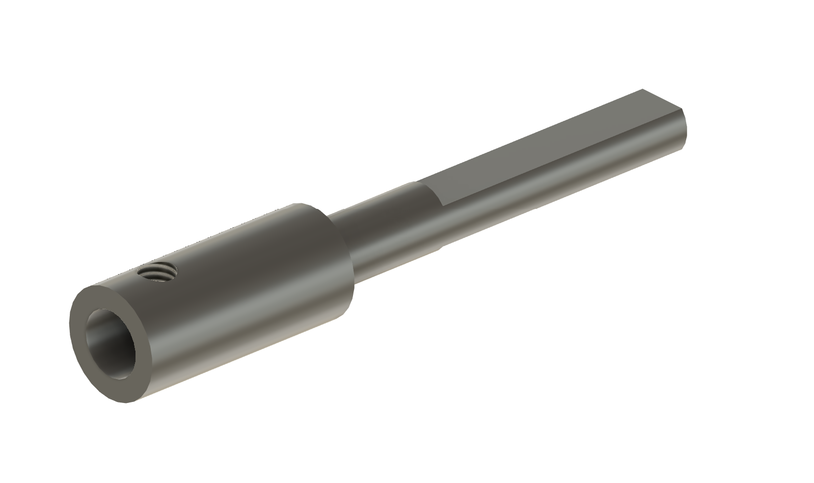
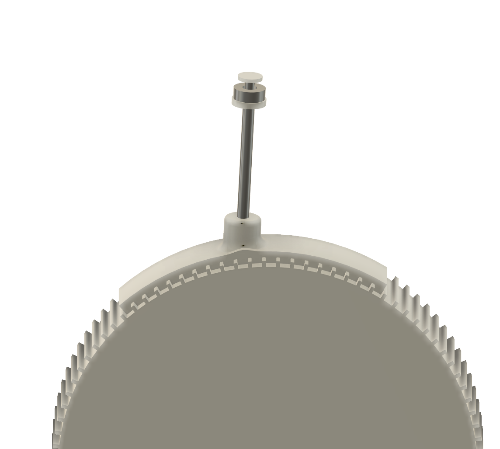
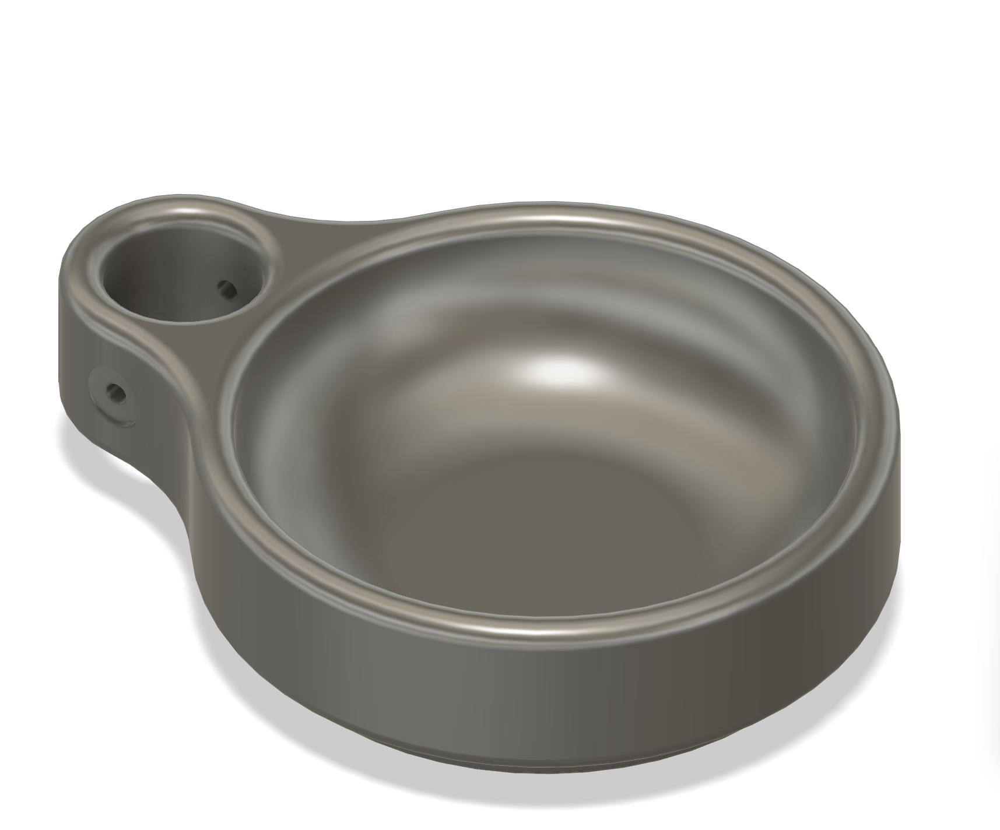

# 3D tištěné díly

Několik dílů zařízení je vyrobeno 3D tiskem. Tato stránka popisuje seznam dílů, kde najít soubory a doporučené nastavení tisku.

**Poznámka:** Podvozek bude pro střední školu již **vytištěn a dodán**, protože vyžaduje velkoformátovou 3D tiskárnu. Ostatní menší díly si lze vytisknout na běžné tiskárně.

## Soubory pro tisk a výkresy

Všechny soubory najdete ve složce [`3D/`](https://github.com/BrnoMarsRover/myMachine-Fan/tree/main/3D) v repozitáři. K dispozici jsou STL soubory (pro tisk) i STEP soubory (pro úpravu v CAD).

Technické výkresy obráběných dílů:

- [`Spojka.pdf`](https://github.com/BrnoMarsRover/myMachine-Fan/blob/main/3D/Spojka.pdf) – výkres příruby (spojky) mezi osou motoru a kolem
- [`klobouk_vykres.pdf`](https://github.com/BrnoMarsRover/myMachine-Fan/blob/main/3D/klobouk_vykres.pdf) – výkres klobouku
- [`tyc_vetrak.pdf`](https://github.com/BrnoMarsRover/myMachine-Fan/blob/main/3D/tyc_vetrak.pdf) – výkres tyče větráku

## Seznam 3D tištěných dílů

### Podvozek (dodán vytištěný)

| Díl | Soubor | Počet kusů | Poznámka |
|-----|--------|-----------|----------|
| Podvozek | `Podvozek No History.step` | 1 | **Dodán vytištěný.** Velkoformátový tisk. |

### Kola a pohon

| Díl | Soubor | Počet kusů | Poznámka |
|-----|--------|-----------|----------|
| Kolo | `kolo.stl` / `kolo.step` | 2 | Kola na motory |
| Guma na kolo | `guma_final.stl` | 2 | Pryžový (TPU) oběžný pás na kolo |
| Adaptér osy motoru | `motor_osa.stl` / `motor_osa.step` | 2 | Spojení osy motoru JGY-370 s kolem |

### Uchycení klobouku

| Díl | Soubor | Počet kusů | Poznámka |
|-----|--------|-----------|----------|
| Uchycení klobouku | `uchyceni_klobouku.stl` / `.step` | 1 | Hlavní díl pro nasazení sombrera |
| Uchycení ložiska klobouku | `uchyceni_loziska_klobouku.stl` | 1 | Lůžko pro ložisko ZKL 51101A |
| Krytka ložiska | `krytka_lozisko.stl` / `.step` | 1 | Krytka zajišťující ložisko |
| Zarážka klobouku | `zarazka_klobouku.stl` | 1 | Zajišťuje klobouk proti sejmutí |

### Nádobka na bonbóny

| Díl | Soubor | Počet kusů | Poznámka |
|-----|--------|-----------|----------|
| Nádobka na bonbóny | `krabicka_bonbony.stl` / `Krabička_Bombóny.step` | 1 | Pro rozvoz balených bonbónů |

## Doporučené nastavení tisku

| Parametr | Hodnota |
|----------|---------|
| Materiál | PLA bílý (Prusament PLA Pristine White) |
| Tryska | 0.4 mm |
| Výška vrstvy | 0.2 mm |
| Výplň | 20 % |
| Perimetry | 3 |
| Podpěry | Kde je potřeba (převisy > 45°) |
| Teplota trysky | 215 °C (dle doporučení výrobce filamentu) |
| Teplota podložky | 60 °C |

<!-- TODO: Ověřit a upravit nastavení podle skutečných tiskových profilů -->

## Příprava po tisku

1. **Odstraňte podpěry** – opatrně odlomte nebo odřízněte
2. **Začistěte hrany** – pilníkem nebo brusným papírem odstraňte otřepy
3. **Zkontrolujte rozměry** – zejména otvory pro ložiska a motory:
   - Ložisko ZKL 626-2Z (vnější průměr 19 mm) musí do otvoru pasovat těsně
   - Motor JGY-370 musí sedět v úchytu bez vůle
4. **Zkušební sestavení** – zkuste nasadit ložiska a motory nanečisto (bez pájení a kabelů)

## Tipy

- Pokud je otvor na ložisko příliš těsný, opatrně ho rozšiřte kulatým pilníkem
- Pokud je naopak příliš volný, lze použít kapku sekundového lepidla
- PLA je citlivé na teplo – nenechávejte díly na přímém slunci nebo v autě
- Při tisku větších dílů může pomoci adhesive (lepidlo na podložku) proti odlepování
