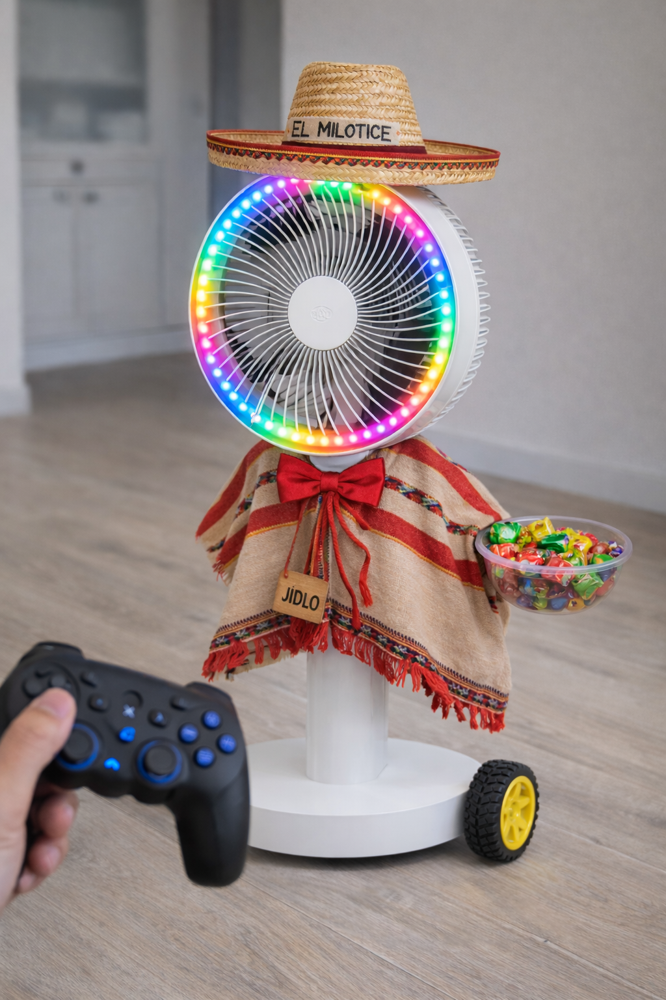

# Kostým a dekorace

Aby větrák vypadal jako mexičan (podle původního návrhu dětí z Milotic), je třeba vyrobit sombrero a poncho. Tato část je **kreativním úkolem pro středoškoláky** – přesný vzhled je na vašem uvážení.

## Sombrero (klobouk)

### Rozměry

- Průměr: přibližně **110 mm**
- Výška: přibližně **120 mm**
- Na přesných rozměrech příliš nezáleží – jde o to, aby na hlavici vypadal dobře a nespadával

### Uchycení

Klobouk je uchycen na vršku hlavice větráku přes **ložisko ZKL 51101A**. Díky ložisku se klobouk může volně otáčet nezávisle na hlavici – při běžícím ventilátoru se klobouk nebude roztáčet spolu s ním.

<!-- TODO: Přidat fotku/nákres uchycení ložiska na hlavici -->

### Materiál

Je zcela na vaší kreativitě – možné materiály:

- Karton / tvrdý papír (nejjednodušší)
- Textil přes drátěnou kostru
- 3D tisk (pokud chcete přesný tvar)
- Plsť / filc
- Kombinace materiálů

## Poncho

### Požadavky

- Musí **neblokovat kola** na spodní straně podvozku
- Musí **neblokovat ventilaci** – nezakrývat mřížku větráku
- Musí **nezakrývat ultrazvukové senzory** na podvozku
- Nesmí se zachytávat do pohyblivých částí
- Mělo by být snadno sundavatelné (pro přístup k elektronice)

### Tipy

- Poncho by mělo zakrývat přechod mezi podvozkem a sloupkem
- Zvažte upevnění na suchý zip nebo gumičku (snadné sundání)
- Typické mexické barvy: červená, zelená, oranžová, žlutá – pruhy nebo vzory

## Nádobka na bonbóny

Nádobka je součástí 3D tištěných dílů (viz [3D tisk](3d_tisk.md)). Slouží pro rozvoz balených bonbónů.

<!-- TODO: Doplnit rozměry nádobky, kam se připevňuje, fotku -->

### Požadavky na nádobku

- Dostatečně velká pro několik balených bonbónů
- Snadno přístupná (děti si bonbóny vezmou samy)
- Bezpečně uchycená, aby nevypadávala při jízdě
- Nesmí překážet ventilátoru ani kolům
