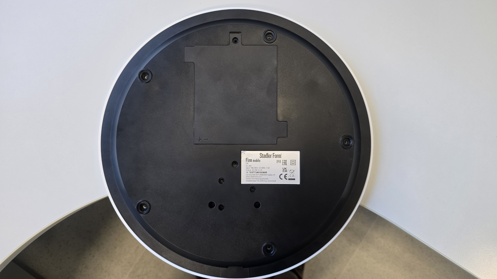
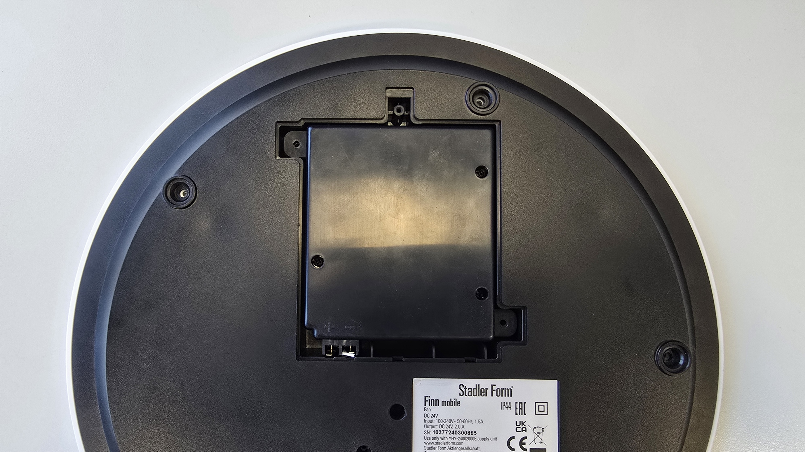
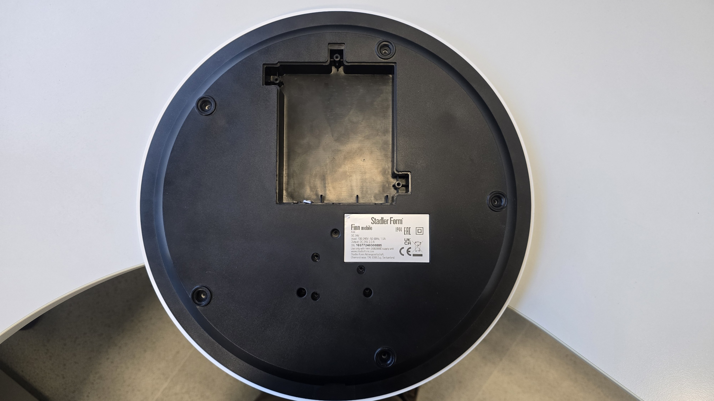
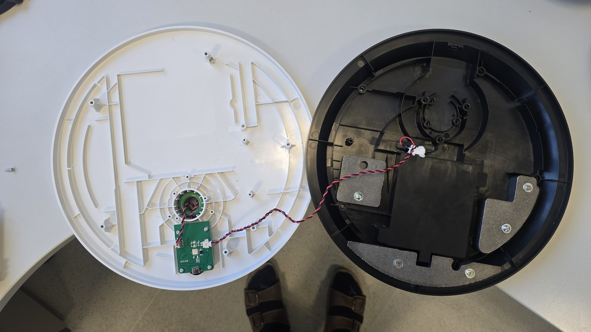
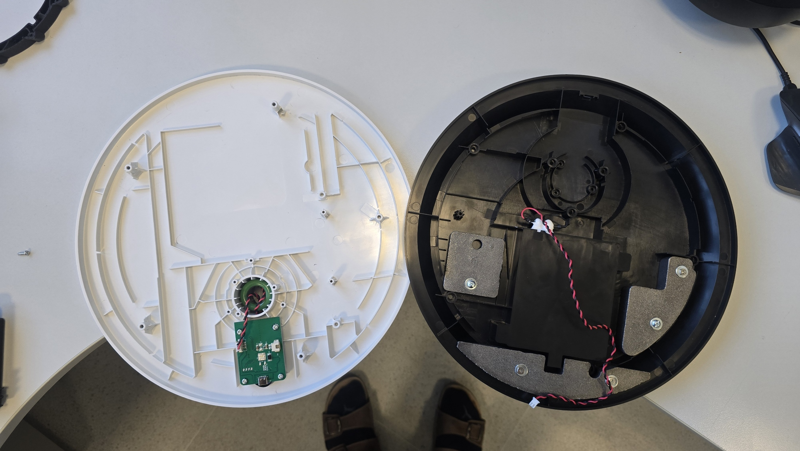
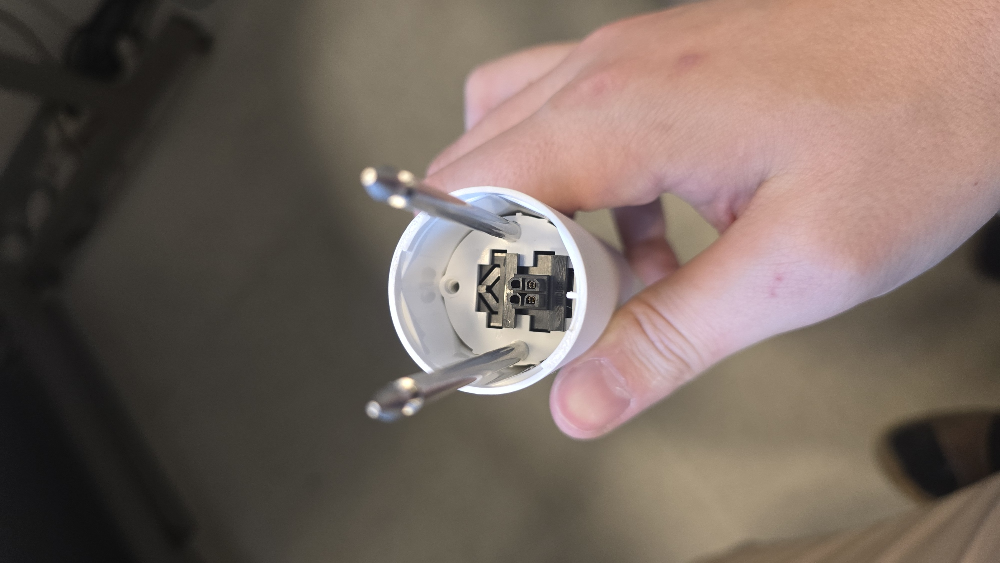
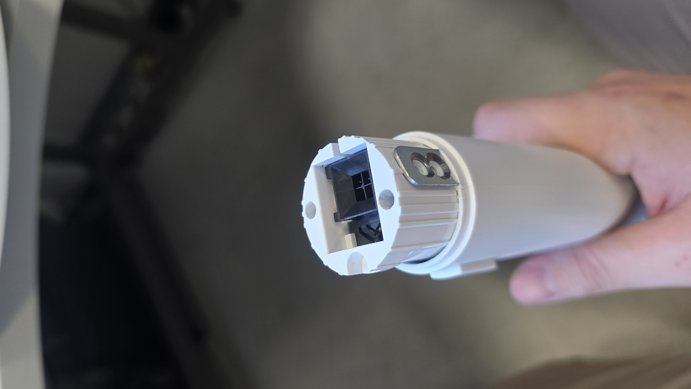
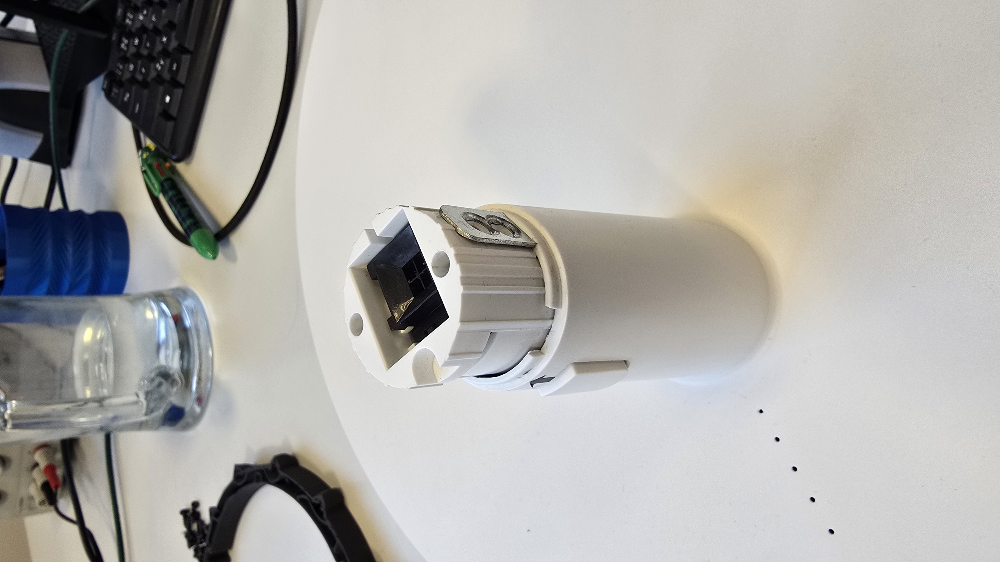
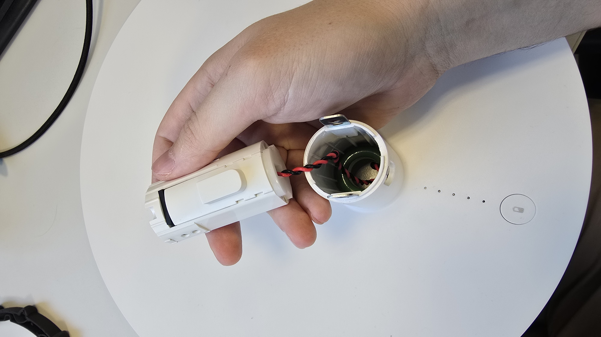
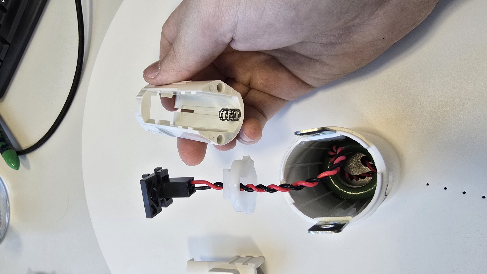

## Jak rozložit původní zařízení?

Zakoupený větrák je velice jednoduché rozložit. V celém procesu není třeba nic páčit, ani vyvíjet hrubou sílu. Všechny díly jsou k sobě sešroubované, v žádném místě zařízení nejsou využity plastové zacvakávací "jazýčky". 

Začněte tím, že si ze zařízení vezmete pouze základnu, otočíte ji vzhůru nohama a odstraníte kryt battery packu připevněný jedním šroubem.

Po otevření přihrádky baterie baterii odšroubujte a vyjměte ze zařízení. Dbejte zvýšenou opatrnost na "pogo piny", které doléhají na kontakty zařízení na levé straně obrázku. Pokud baterii neopatrně vyjmete nebo vložíte, je velice jednoduché tyto piny zalomit.
V případě, že se vám to i tak povede, přikládáme vám pár náhradních :)

Po vyjmutí baterie již můžeme přistoupit k odejmutí černého spodního krytu. Drží jej dohromady 11 šroubů, přičemž 5 z nich je schovaných pod gumovými nožičkami.
POZOR! Tento díl je přidělaný kabelem k desce plošných spojů, která je uchycená k bílému krytu na druhé straně. Odejměte ho tedy pomalu a kabel nejprve odpojte.

Černý díl budeme v našem zařízení nahrazovat, až budeme mít náhradu z 3D tiskárny, bude třeba přenést bateriové kontakty s kabelem do nového dílu.
Druhý kabel z desky plošných spojů vede sloupkem směrem k samotným motorkům větráku. My budeme k těmto napájecím kabelům přidávat i datový kabel pro ovládání světelného LED pásku. Konektor vedoucí sloupkem má ještě dvě neosazené pozice, vytvoříme tedy dodatečný kabel, který protáhneme celou délkou sloupku.

Rozborka sloupku a všech konektérů v serii je podobná, ukážeme si příklad na sloupku samotném. Z jedné strany sloupku uvnitř vyjmeme aretační šroubek.

Z druhé strany sloupku vyjmeme 4 aretační šroubky z bočních stran

Bez výrazné použité síly nyní můžeme konektory ze sloupku vyjmout. Na jedné straně k tomu bude třeba protlačit boční tlačítko dovnitř (taktéž i u spodního konektoru pod sloupkem na fotografii níže).

Samotný mechanismus s tlačítkem je složen z několika dílů. Dávejte při otevření pozor, uvnitř je umístěná pružina. 

Na poprvé to bude možná trochu zápas, zkuste si hned po rozložení mechanismus opět složit, aby jste si zapamatovali, jak do sebe zapadá.

Po celé délce sloupku bude nutné nahoru k motorům v budoucnu vyvést i signálový kabel k LED pásku.
