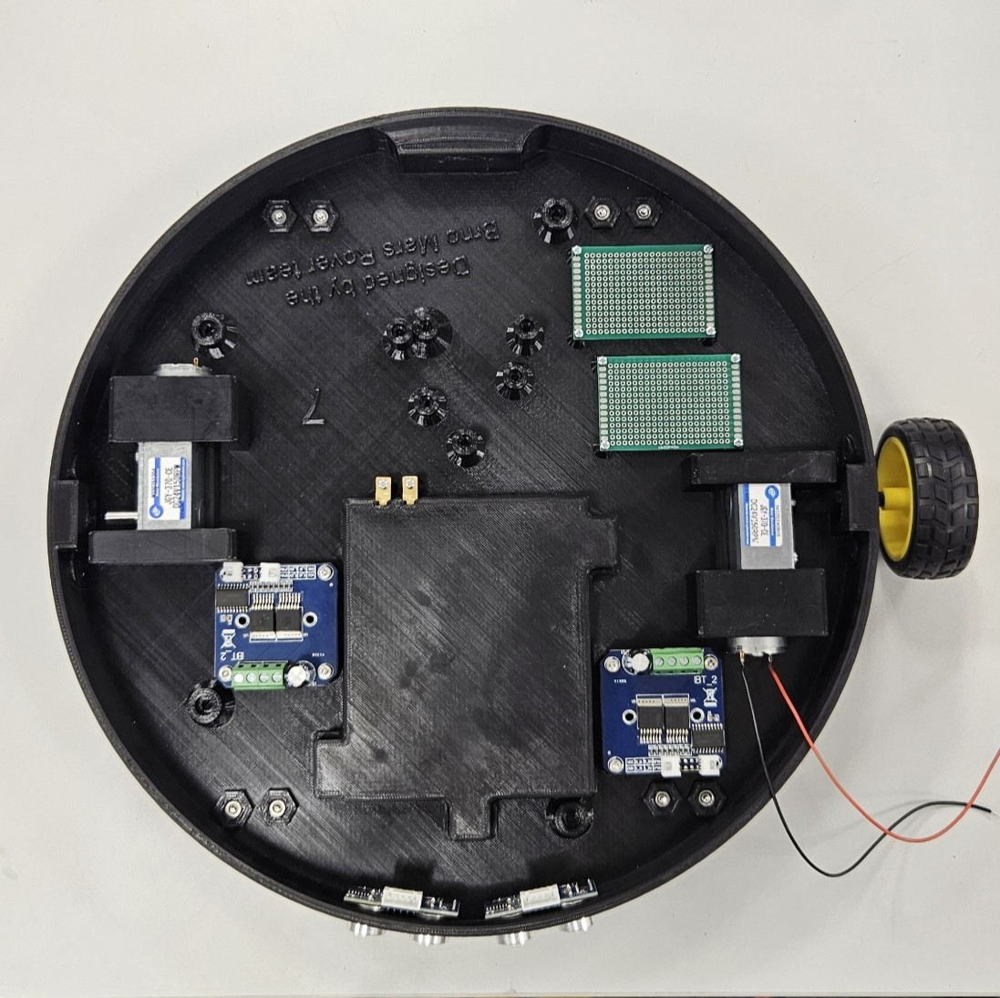
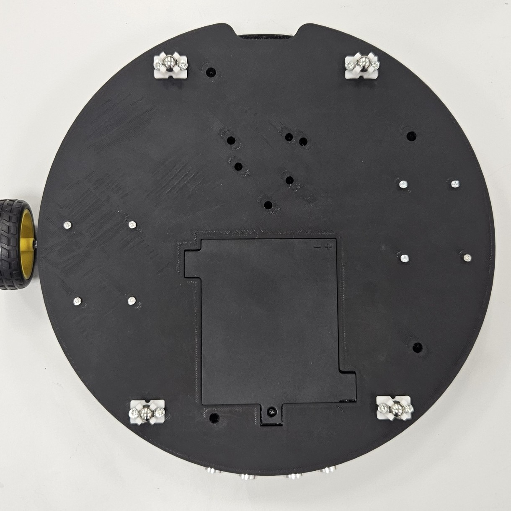
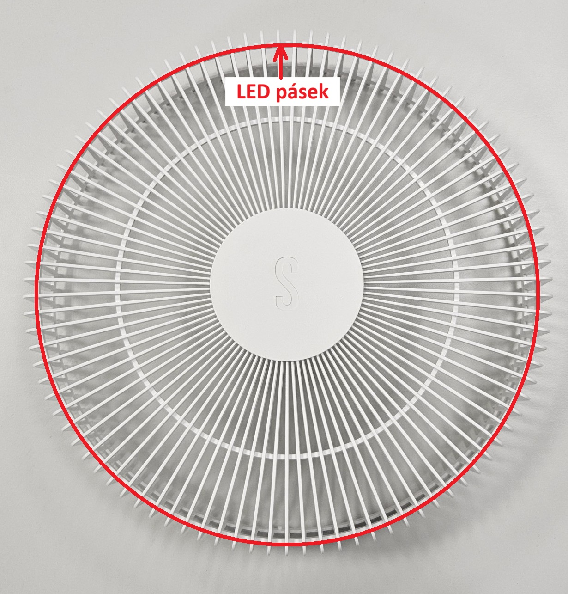
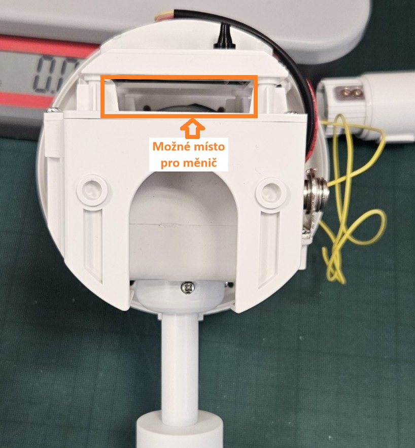
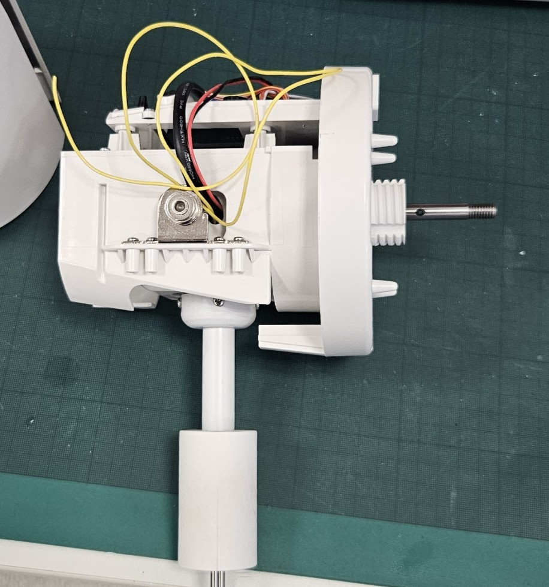
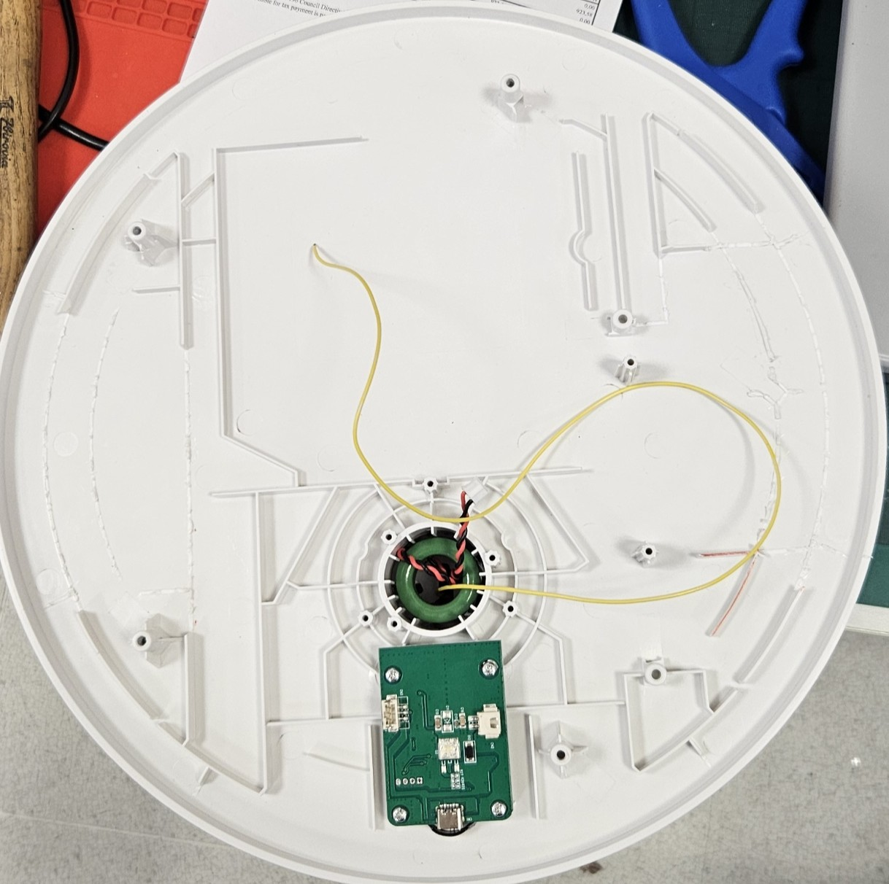

## Podvozek
Podvozek je třeba správně propojit s ostatním komponenty, viz schéma.
Konektory jednotlivých komponent jsou již připraveny a pro účely propojení s řídícím mikrokontrolerem jsou v podvozku dva univerzální plošné spoje.

Pohled zvrchu:

Pohled zespodu:

Ultrazvukové senzory jsou pouze vtlačeny do děr, zbytek komponentů drží šroubky. Svorky na motory jsou připěvněny pomocí šroubků ze spodní strany.

## LED
LED pásek je třeba připevnit podél obvodu klece větráku (třeba pomocí utahovacích pásků)

Pro napájení LED pásku je třeba do hlavice umístit DC-DC měnič na konverzi z 24 V na 3.7 V.

Pro komunikaci s mikrokontrolerem je připraven žlutý drát vyvedený do hlavice a podstavce (drát je připojen pomocí konektorů uvnitř trubky konstrukce, takže je stále rozebíratelná) 

Hlavice:

Podstavec:

