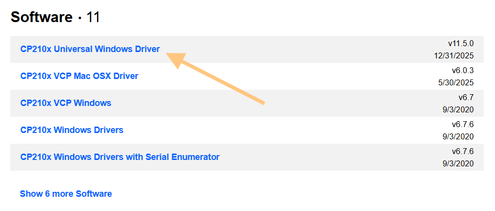
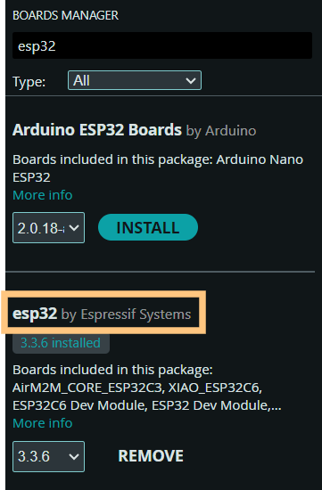

# Instalace
Desku lze programovat v prostředí [Arduino IDE](https://www.arduino.cc/en/software/), [Arduino in 100 seconds](https://www.youtube.com/watch?v=1ENiVwk8idM&pp=ygUMYXJkdWlubyBpZGUg)


Pro správnou komunikaci s deskou je potřeba nainstalovat ovladač: [zde](https://www.silabs.com/software-and-tools/usb-to-uart-bridge-vcp-drivers?tab=)



Dále v Arduino IDE nainstalovat desky ESP32.
V záložce Tools -> Boards: -> Board Manager nainstalovat balíček esp32



Pro nahrání je potřeba vybrat správný COM port a desku ESP32 Dev Module

Pro otestování, že se kód správně nahrává, lze použít tento kód, který rozbliká LEDku na modulu:

```cpp
void setup() {
  Serial.begin(9600);
}

void loop() {
  delay(500);
  Serial.println("Hello World!");
}
```
## Seznam doporučených knihoven
Knihovny lze instalovat pomocí *Library manager* (vlevo)

- [BLE-Gamepad-Client](https://github.com/tbekas/BLE-Gamepad-Client) pro komunikaci s dálkovým ovladačem
- [Adafruit Neopixel](https://github.com/adafruit/Adafruit_NeoPixel) pro ovládání LED pásku
- [Ultrasonic](https://github.com/ErickSimoes/Ultrasonic) pro práci s ultrazvukovými čidly

Na stránkách knihoven jsou i ukázky použití 

## Ovládání motorů
Motor lze řídit pomocí příkazu  ```analogWrite(pin, hodnota)```.

Kdy hodnota je číslo od 0 (netočí) po 255 (maximální rychlost). Směr se určuje podle pinu (R_PWM jeden směr, L_PWM opačný), na kterém danou hodnotu nastavím, viz schéma.

**Pozor**: Nenastavujte nikdy otáčení jednoho motoru do obou směrů zároveň, jinak by mohlo dojít k poškození driveru!
```cpp
// Špatně
analogWrite(R_PWM, 100);
analogWrite(L_PWM, 50);

// Správně
analogWrite(R_PWM, 100);
analogWrite(L_PWM, 0);

analogWrite(R_PWM, 0);
analogWrite(L_PWM, 50);
```

# Požadované funkce

- Ovládání pomocí dálkového ovladače, levý joystick pohyb vpřed(vzad), pravý zatáčení doprava/doleva
- Zamezení nárazu do překážek pomocí čidel měření dálky (ultrazvuková čidla)
